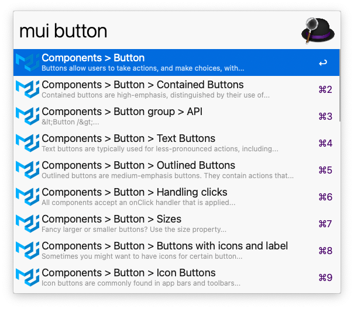

# alfred-material-ui

> [Alfred 3](https://www.alfredapp.com) workflow to search through the [Material-UI](https://material-ui-next.com/) documentation.



## Install

```
$ npm install --global alfred-material-ui
```

_Requires [Node.js](https://nodejs.org) 6+ and the Alfred [Powerpack](https://www.alfredapp.com/powerpack/)._

## Usage

In Alfred, type `mui`, <kbd>Enter</kbd>, and your query.

Select an item and press <kbd>Enter</kbd> to go to its [Material-UI](https://material-ui-next.com/) documentation.

## Options

To open the options run `npm install` inside this package directory.

### language

The language of the documentation. Supported values: `en`, `de`, `fr`, `pt`, `es`, `ja`, `zh`, `ru`

### branch

The version of the documentation, Supported values: `master`, `next`

### hitsPerPage

The amount of search results shown.

## License

MIT © [Henrik Wenz](https://github.com/HaNdTriX)
